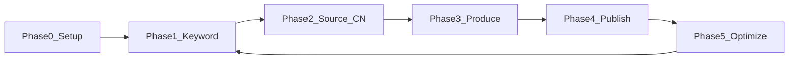

# Quy trình chuẩn — YouTube + TikTok đa kênh (EN market)

> **Mục tiêu:** Mỗi niche = 1 Account Group → 1 YouTube + 1 TikTok → pipeline CN→EN → publish → tối ưu viral.  
> **Thị trường:** Tiếng Anh (US/EU). **Stack:** AiToEarn (self-host) + KrillinAI + công cụ keyword miễn phí.

---

## Tổng quan 5 phase



| Phase | Tần suất | Thời gian | Output |
|-------|----------|-----------|--------|
| 0 — Setup | 1 lần | 2–4h | Docker + OAuth + 6 tài khoản |
| 1 — Keyword | Hàng tuần / niche | 2h | 10 keyword + 10 video ideas |
| 2 — Source | Hàng tuần | 3h | 5–10 URL video CN |
| 3 — Produce | Hàng ngày | 30–60p/video | MP4 EN + draft AiToEarn |
| 4 — Publish | Hàng ngày | 15p | Lịch YT + TikTok |
| 5 — Optimize | Hàng tuần | 30p/niche | Quyết định scale/kill |

---

## Quy ước đặt tên (bắt buộc)

| Đối tượng | Pattern | Ví dụ |
|-----------|---------|-------|
| Account Group | `{niche_slug}` | `life_hacks` |
| YouTube | `yt_{niche}` | `yt_life_hacks` |
| TikTok | `tt_{niche}` | `tt_life_hacks` |
| Draft plan | `{niche}_weekly` | `life_hacks_weekly` |
| Folder assets | `{niche}/raw`, `/dubbed`, `/published` | Trong Agent Assets |

**3 niche khởi điểm:**

| Niche | Seed keyword | Mix content |
|-------|-------------|-------------|
| `life_hacks` | life hacks 2026 | 70% repurpose CN + 30% AI |
| `ai_tools` | AI tools for... | 50% AI + 50% repurpose |
| `cooking_60s` | 60 second recipes | 80% repurpose + 20% AI |

---

## Phase 0 — Setup (một lần)

### Checklist

- [ ] Docker chạy: `cd AIToEarn && docker compose up -d` → http://localhost:8080
- [ ] 3 Account Groups đã seed (`life_hacks`, `ai_tools`, `cooking_60s`)
- [ ] Relay OAuth hoặc self-host OAuth YouTube + TikTok
- [ ] Gemini API key (bắt buộc)
- [ ] (Tuỳ chọn) Seedance/Grok key cho AI video gốc
- [ ] KrillinAI cài trên Windows
- [ ] Import `keyword-bank.csv` vào Google Sheet

**Chi tiết:** [DEPLOY.md](./DEPLOY.md) · [CONFIG.md](./CONFIG.md) · [SETUP-NICHES.md](./SETUP-NICHES.md) · [KRILLINAI.md](./KRILLINAI.md)

### Connect 6 tài khoản (UI)

1. Mở **Publish** (`/accounts`)
2. Với mỗi group `life_hacks`, `ai_tools`, `cooking_60s`:
   - Add account → **YouTube** → OAuth
   - Add account → **TikTok** → OAuth

---

## Phase 1 — Nghiên cứu từ khóa (hàng tuần, mỗi niche 2h)

### Công cụ

| Tool | Miễn phí | Dùng để |
|------|----------|---------|
| YouTube Autocomplete | Yes | Long-tail queries |
| TikTok Search suggest | Yes | Trend angles |
| Google Trends | Yes | Seasonal timing |
| TikTok Creative Center | Yes | Hashtag + sound |
| YoTrends / Virlo / Kurrently | Trả phí | Scale sau |

### 7 bước chuẩn

1. Chọn **seed keyword** (tên niche)
2. Thu **50 autocomplete** (YouTube + TikTok, incognito)
3. Gắn **intent**: `learn` | `watch` | `compare` | `how-to`
4. Chọn **top 10** → viết video idea (1 dòng/keyword)
5. Cập nhật Google Sheet / `keyword-bank.csv`
6. Tìm **5–10 video CN** (Bilibili/Douyin) khớp top keyword
7. Ghi `cn_source_url` + `priority` vào sheet

**Mix mục tiêu:** 70% evergreen · 20% seasonal · 10% trend

**Chi tiết:** [KEYWORD_WORKFLOW.md](./KEYWORD_WORKFLOW.md)

---

## Phase 2 — Lấy nguồn Trung Quốc

| Nguồn | Loại content | Cách lấy |
|-------|-------------|----------|
| Douyin | Short viral | Browse + download tool |
| Bilibili | Tutorial, explainer | URL → KrillinAI / yt-dlp |
| Kuaishou | Life content | Tương tự Douyin |
| Xiaohongshu | Lifestyle tips | Manual / screen record |

### Tiêu chí chọn video CN

- [ ] Dưới 60s (Shorts/TikTok friendly)
- [ ] Visual rõ, ít phụ thuộc text tiếng Trung trên màn hình
- [ ] Transform được (dub + edit, không re-upload raw)
- [ ] Khớp keyword đã chọn ở Phase 1

**Cảnh báo:** Repurpose phải **transform đáng kể** (dub EN, cắt, commentary) — tránh copyright strike.

---

## Phase 3 — Sản xuất (2 track)

### Track A — Repurpose CN → EN (chính)

```
CN URL → KrillinAI (download + ASR + dịch + Edge TTS dub) → vertical MP4
       → Upload AiToEarn Agent Assets
       → Draft Box: generate metadata (Gemini)
       → Review title / description / 3–5 hashtags
```

**Voice khuyến nghị:**

| Use case | Tool |
|----------|------|
| Bulk Shorts/TikTok | Edge TTS (free, qua KrillinAI) |
| Premium YouTube | ElevenLabs Multilingual v2 |
| AI video gốc | Grok / Seedance trong Draft Box |

### Track B — AI generate gốc

```
Keyword từ Phase 1 → Draft Box → AI Batch Generate
→ Seedance 2 / Grok / HappyHorse → review → draft
```

### Hook 3 giây đầu (bắt buộc review)

- Pattern interrupt / bold claim / before-after
- Test 3 biến thể hook → publish cách 24h

**Chi tiết:** [KRILLINAI.md](./KRILLINAI.md)

---

## Phase 4 — Publish đa nền tảng

### Tần suất (EN market, EST)

| Platform | Số video/ngày | Khung giờ test |
|----------|---------------|----------------|
| TikTok | 1–3 / niche | 7–9am, 12–1pm, 7–9pm |
| YouTube Shorts | 1–2 / niche | Lệch 2–4h sau TikTok |

### Trong AiToEarn

1. **Publish → Calendar** — kéo draft vào slot
2. Chọn account: `yt_{niche}` + `tt_{niche}`
3. Confirm Shorts format + hashtags
4. Publish hoặc schedule

### Batch tuần 1

| Niche | Mục tiêu video |
|-------|----------------|
| life_hacks | 5–10 |
| ai_tools | 5–10 |
| cooking_60s | 5–10 |

**Chi tiết:** [FIRST-PUBLISH.md](./FIRST-PUBLISH.md)

---

## Phase 5 — Tối ưu & viral loop (hàng tuần, 30p/niche)

### Metrics theo dõi

| Metric | TikTok | YouTube Shorts |
|--------|--------|----------------|
| Completion rate | >50% | >70% |
| Rewatch rate | >10% | — |
| Shares / saves | Top 10% niche | Top 10% niche |

### Hành động cố định

1. **Top 3 video** → phân tích hook/topic → nhân bản
2. **Bottom 3** → dừng pattern đó
3. Cập nhật keyword bank
4. Google Trends — double down topic đang rising
5. Quay lại Phase 1

---

## Lịch vận hành mẫu (1 tuần)

| Ngày | Việc |
|------|------|
| **T2** | Keyword research 3 niche (6h total) |
| **T3** | Source CN + queue KrillinAI (10 video) |
| **T4–T6** | Produce 3–5 video/ngày + schedule tuần sau |
| **T7** | Publish buffer + analytics sơ bộ |
| **CN** | Weekly review Phase 5 (1.5h) |

---

## Tool stack tóm tắt

| Vai trò | Tool | Doc |
|---------|------|-----|
| Hub publish + AI draft | **AiToEarn** (localhost:8080) | DEPLOY, CONFIG |
| CN→EN dub | **KrillinAI** | KRILLINAI |
| Keyword | Autocomplete + Sheet | KEYWORD_WORKFLOW |
| Voice EN | Edge TTS / ElevenLabs | KRILLINAI |
| Download CN | yt-dlp / KrillinAI | KRILLINAI |

---

## Chi phí ước tính (3 niche)

| Hạng mục | USD/tháng |
|----------|-----------|
| VPS Docker (nếu cloud) | $10–20 |
| Gemini API | $5–15 |
| AI video gen (optional) | $20–50 |
| ElevenLabs (optional) | $11–22 |
| KrillinAI + keyword free | $0 |
| **Tổng** | **~$50–110** |

---

## Troubleshooting nhanh

| Vấn đề | Xử lý |
|--------|--------|
| OAuth fail | Check Relay API key — CONFIG.md |
| AI metadata fail | Check Gemini key trong Config Manager |
| Docker down | `docker compose up -d` |
| Seed groups lại | `.\ops\scripts\seed-niches.ps1` |
| Billing UI xuất hiện | Sai repo — dùng `youtubetiktok/AIToEarn`, không dùng Tako |

---

## Tài liệu liên quan

| File | Nội dung |
|------|----------|
| [AUDIT.md](./AUDIT.md) | Kết quả audit billing + readiness |
| [README.md](./README.md) | Index tất cả runbooks |
| [INTERNAL_USE.md](../INTERNAL_USE.md) | Phạm vi fork nội bộ |
| [keyword-bank.csv](./keyword-bank.csv) | Template tracking |

---

## Quick start hôm nay (30 phút)

1. http://localhost:8080 → Configuration → Relay + Gemini
2. Publish → connect 2 account cho `life_hacks`
3. Import keyword-bank vào Google Sheet
4. KrillinAI: dub 1 video test từ Bilibili
5. Upload → Draft Box → schedule 1 Shorts lên YT + TikTok
